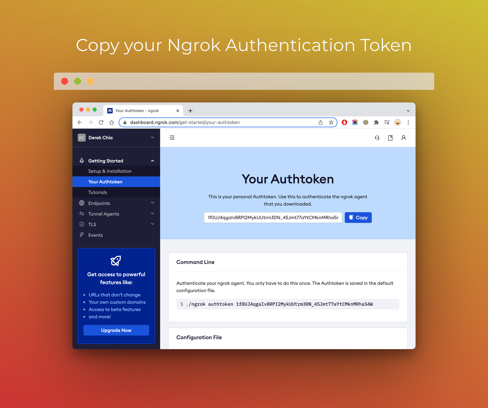
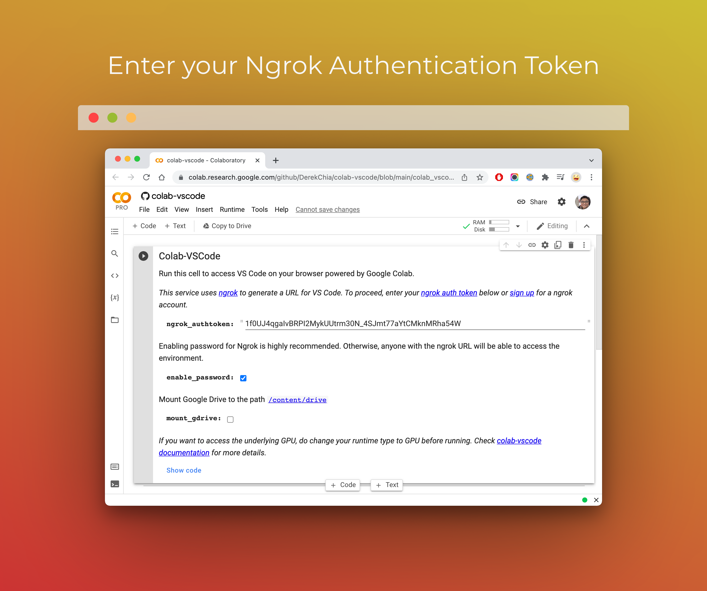
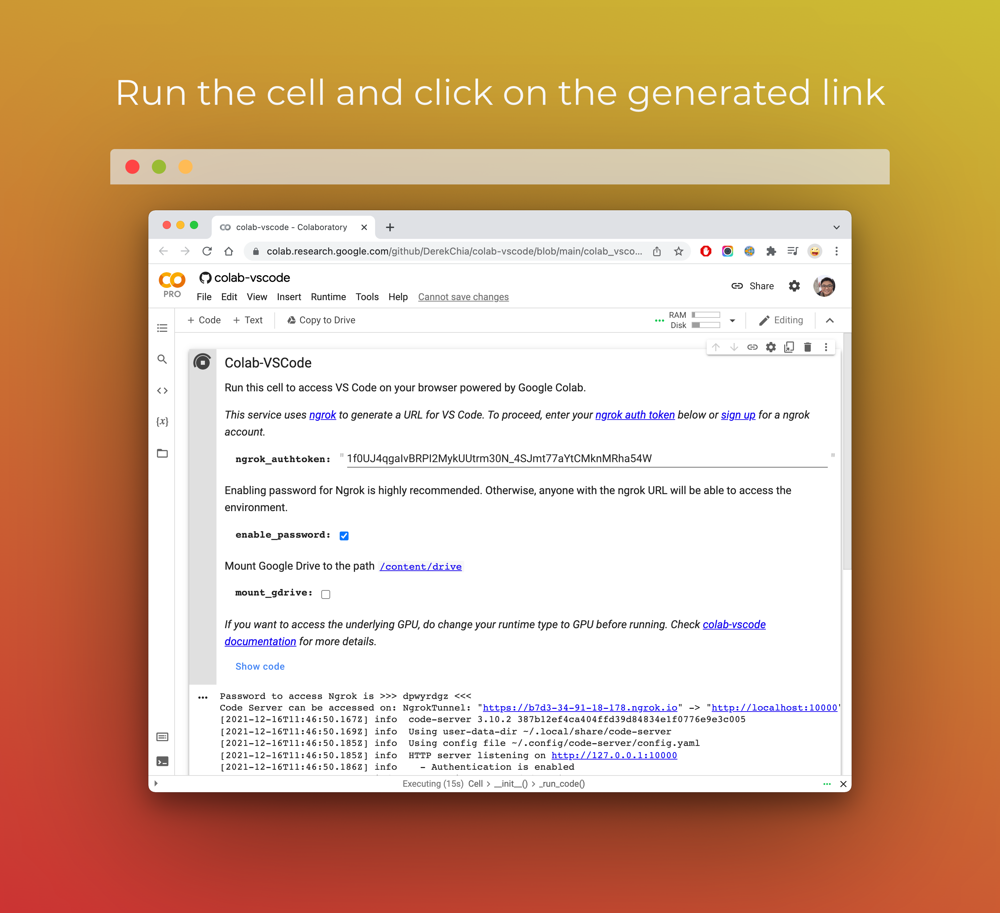
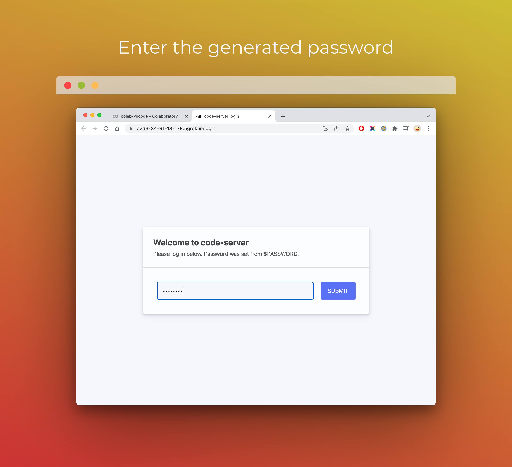
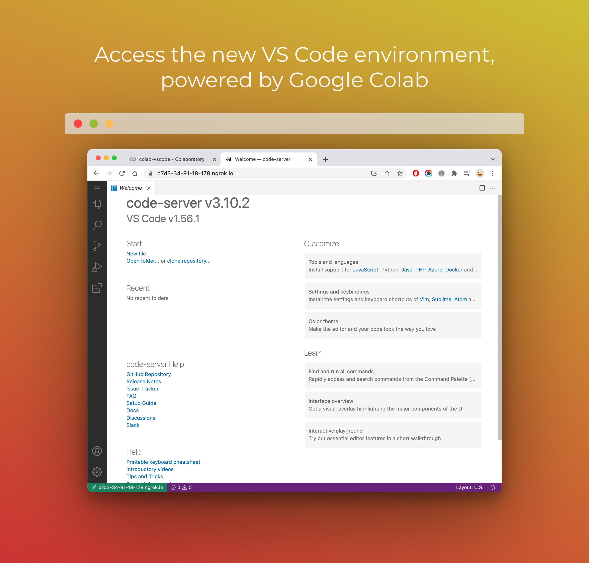

# Colab-VSCode

Ever wanted to use VS Code to run your code instead of Google Colab? Now you can! Run the following [Colab notebook](https://colab.research.google.com/github/DerekChia/colab-vscode/blob/main/colab_vscode.ipynb) to generate a VS Code environment. You will have full terminal access to run your `Python` scripts together with `pip` to install your packages. Even better, you get to access GPU acceleration when you select the GPU runtime!

## Quick Start

0. Get ready your Ngrok Authentication Token. Copy your [Ngrok Authentication token here](https://dashboard.ngrok.com/get-started/your-authtoken) or [sign up](https://dashboard.ngrok.com/signup) for a Ngrok account
1. Click on the [Google Colab button](https://colab.research.google.com/github/DerekChia/colab-vscode/blob/main/colab_vscode.ipynb) below
2. Run the cell with Ngrok authentication token
3. There is no step 3!

## Step-by-Step Instruction

## License

[MIT](LICENSE)
